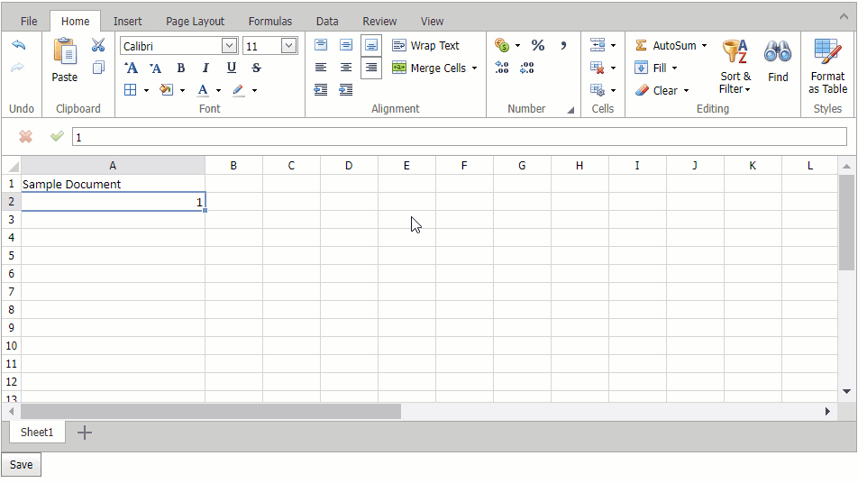

<!-- default badges list -->

<!-- default badges end -->
# Spreadsheet for ASP.NET Web Forms - How to save/load documents to/from a database

This example demonstrates how to configure the [Spreadsheet control](https://docs.devexpress.com/AspNet/16157/components/spreadsheet) to work with a database. 

## Overview

During page initialization, load a document from a database as a byte array and pass it to the control's [Open](https://docs.devexpress.com/AspNet/DevExpress.Web.ASPxSpreadsheet.ASPxSpreadsheet.Open(System.String-DevExpress.Spreadsheet.DocumentFormat-System.Func-System.Byte---)) method to open the document in the Spreadsheet.

The [Saving](https://docs.devexpress.com/AspNet/DevExpress.Web.ASPxSpreadsheet.ASPxSpreadsheet.Saving) event occurs when a user clicks the built-in **Save** or **SaveAs** command in the Spreadsheet's Ribbon UI. To save changes, handle the `Saving` event and update the data source. To save the document after a user clicks a custom button, update the database in the button's [Click](https://docs.devexpress.com/AspNet/DevExpress.Web.ASPxButton.Click?p=netframework) event handler.

> **Note**  
> When a user changes a cell value, the Spreadsheet control applies the entered value only after the user moves focus to another cell. A new cell value cannot be saved until the control applies it. To apply the pending cell value change, call the [ApplyCellEdit](https://docs.devexpress.com/AspNet/js-ASPxClientSpreadsheet.ApplyCellEdit?p=netframework) method.

## Files to Review
* [Default.aspx](./CS/ASPxSpreadsheetBinding/Default.aspx) (VB: [Default.aspx](./VB/ASPxSpreadsheetBinding/Default.aspx))
* [Default.aspx.cs](./CS/ASPxSpreadsheetBinding/Default.aspx.cs) (VB: [Default.aspx.vb](./VB/ASPxSpreadsheetBinding/Default.aspx.vb))

## Documentation

* [Spreadsheet Document Management](https://docs.devexpress.com/AspNet/116406/components/spreadsheet/document-management)
* [Querying Data with the SqlDataSource Control](https://learn.microsoft.com/en-us/aspnet/web-forms/overview/data-access/accessing-the-database-directly-from-an-aspnet-page/querying-data-with-the-sqldatasource-control-cs)

## More Examples

* [Spreadsheet for ASP.NET MVC - How to save/load documents to/from a database](https://github.com/DevExpress-Examples/asp-net-mvc-spreadsheet-work-with-database)
<!-- feedback -->
## Does this example address your development requirements/objectives?

 

(you will be redirected to DevExpress.com to submit your response)
<!-- feedback end -->
